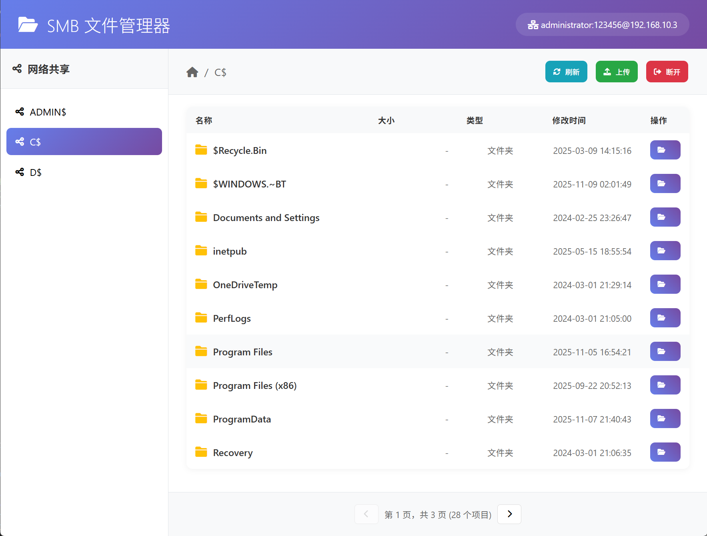
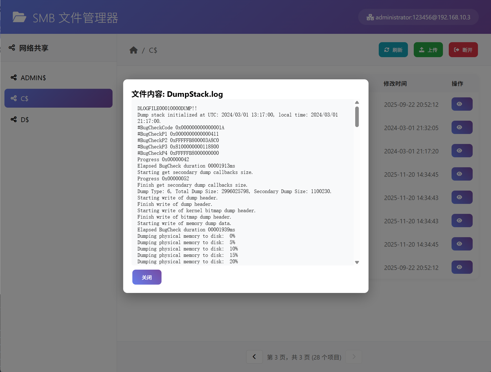
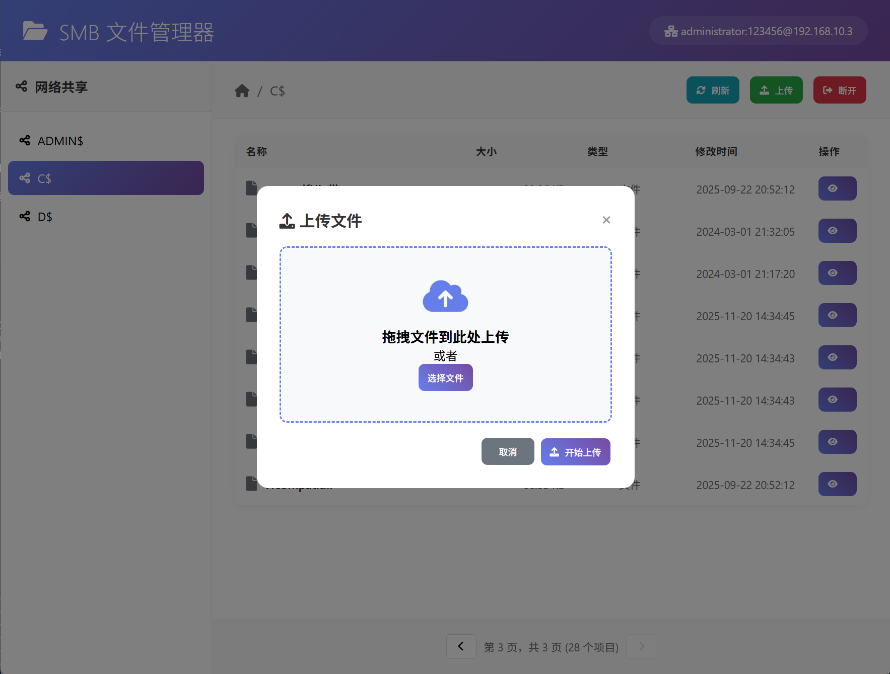

# SMB Client GUI

一个基于 Python + PyWebView 的现代化 SMB/CIFS 网络文件管理器桌面应用，提供直观的图形界面来访问和管理网络共享文件。

## ✨ 主要特性

### 🔗 连接管理
- **连接字符串支持**：支持 `username:password@server[:port]` 格式
- **域认证支持**：支持 `DOMAIN\\username:password@server` 格式
- **自动版本检测**：自动识别并支持 SMBv1/SMBv2.0/SMBv2.1/SMBv3.0
- **会话类型识别**：自动识别 guest session 和 user session

### 📁 文件管理
- **现代化界面**：类似 Windows 资源管理器的用户体验



- **文件预览**：无需下载支持文本文件、图片文件的在线预览



- **智能文件处理**：大文件（>2MB）和不可读文件自动提示下载

- **拖拽上传**：支持拖拽文件到浏览器进行上传



- **分页显示**：每页显示 10 个文件，便于管理大量文件


### 🎨 用户体验
- **响应式设计**：现代化的用户界面，支持窗口大小调整
- **实时反馈**：详细的操作状态提示和进度显示
- **多语言日志**：使用 emoji 标记的清晰日志输出
- **文件操作**：统一的按钮样式，垂直布局的操作面板

## 🚀 快速开始

### 环境要求
- Python 3.7+
- Windows/Linux/macOS

### 安装依赖
```bash
pip install -r requirements.txt
```

### 运行应用
```bash
python smb_gui.py
```

## 📖 使用说明

### 连接到 SMB 服务器
1. 启动应用后，在连接字符串输入框中输入：
   ```
   administrator:123456@192.168.10.3
   ```
2. 点击连接按钮
3. 连接成功后自动显示共享列表

### 连接字符串格式
```
username:password@server              # 基本格式
DOMAIN\\username:password@server      # 域认证
username:password@server:port         # 指定端口
DOMAIN\\username:password@server:port # 域认证 + 端口
```

### 文件操作
- **查看文件夹**：点击文件夹名称进入目录
- **面包屑导航**：点击面包屑中的任意层级快速导航
- **文件预览**：点击小文件（<2MB）的文件名直接预览
- **下载文件**：点击下载按钮保存到 `download` 目录
- **上传文件**：点击上传按钮或拖拽文件到浏览器
- **文件信息**：点击详情按钮查看文件属性

### 支持的预览格式
- **文本文件**：txt, log, ini, conf, md, json, xml, csv, jpg, jpeg, png, gif, bmp, webp, jsp, jspx, html, py, sh, js, css, bat
- **图片文件**：jpg, jpeg, png, gif, bmp, webp

## 📂 项目结构

```
SmbClientGUI/
├── smb_gui.py          # 主应用程序入口
├── smb_handler.py      # SMB 操作处理器
├── requirements.txt    # Python 依赖包
├── download/          # 下载文件默认保存目录
└── templates/
    └── main.html      # 前端用户界面
```

## 🛠️ 技术架构

### 后端技术栈
- **PyWebView**：桌面应用框架
- **Impacket**：SMB/CIFS 协议实现库
- **Python 3.7+**：后端开发语言

### 前端技术栈
- **HTML5 + CSS3**：现代化用户界面
- **JavaScript ES6+**：前端交互逻辑
- **Font Awesome**：图标库
- **响应式设计**：适配不同屏幕尺寸

### 核心功能模块
1. **SMBHandler**：SMB 协议操作封装
2. **SMBApi**：前后端 API 接口
3. **File Manager**：文件管理界面
4. **Path Parser**：路径解析和转义处理

## 🔧 配置说明

### 窗口设置
- 默认大小：1200x950 像素
- 支持调整大小
- 调试模式：默认开启

### 文件限制
- 分页大小：每页 10 个文件
- 预览限制：< 2MB
- 上传限制：支持所有文件类型

### 下载设置
- 默认保存路径：`./download/`
- 自动创建下载目录
- 完整下载状态反馈

## 📝 开发日志


### 特色功能
- 🎯 精确的路径解析，支持复杂共享名
- 🔄 智能 Base64 编码，避免大文件栈溢出
- 🎨 现代化的 UI 设计，流畅的动画效果
- 📱 响应式布局，适配不同屏幕
- 🛡️ 完善的错误处理和用户提示

## 📄 许可证

本项目基于 MIT 许可证开源。

## 🤝 贡献

欢迎提交 Issue 和 Pull Request 来改进这个项目！

## 📞 支持

如果您在使用过程中遇到问题，请：
1. 检查 Python 版本是否符合要求
2. 确认所有依赖包已正确安装
3. 查看控制台输出的错误信息
4. 提交 Issue 并附上详细的错误日志